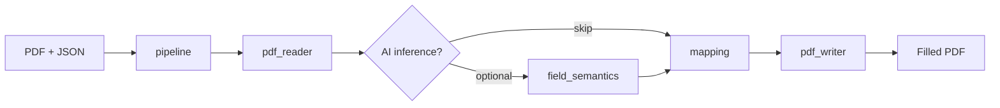

<div align="center">

# PDF Autofiller

**Fill AcroForm PDFs from JSON — no manual field mapping.**

Open-source FastAPI service with deterministic-first mapping, optional AI inference, and a browser playground.

[](https://github.com/lindseystead/ai-pdf-autofiller/actions/workflows/test.yml)
[](https://github.com/lindseystead/ai-pdf-autofiller/releases)
[](https://www.python.org/downloads/)
[](https://github.com/lindseystead/ai-pdf-autofiller)
[](LICENSE)

[Try in Codespaces](#try-it-now) · [Install](#install) · [API](#api) · [Docs](docs/) · [Recipes](recipes/)

[](https://codespaces.new/lindseystead/ai-pdf-autofiller)

</div>

---

## Overview

Government, HR, and insurance PDFs all use different field names for the same data. Your app stores `first_name`; the form wants `txtFName`, `givenName`, or `field_12`.

PDF Autofiller maps JSON to AcroForm fields automatically:

1. **Normalize** keys and match against alias packs (W-9, HR onboarding, and more)
2. **Coerce** values to the correct type (dates, numbers, booleans)
3. **Optionally infer** field meaning with AI — only when you enable it
4. **Reject** incomplete output when required fields are unresolved

Deterministic mapping is the default path: auditable, repeatable, and free to run without an API key.

## Features

- HTTP API with structured error codes and fill-outcome response headers
- Browser playground at `/playground` for drag-and-drop testing
- Python SDK (`fill()` helper and `PDFAutofillerClient`)
- Community alias packs and copy-paste recipes for common forms
- Docker image on GHCR, Render blueprint, and GitHub Release wheels
- Auth, rate limits, and DoS guards enabled by default

## Try it now

**Fastest path — GitHub Codespaces** (free tier, no local install):

1. Click **Open in GitHub Codespaces** above
2. Wait ~60 seconds for setup
3. Browser opens **`/playground`** — upload a PDF, paste JSON, download the result

**One-line terminal demo** (after the API is running):

```bash
curl -s -X POST http://localhost:8000/fill \
  -F "pdf_file=@samples/sample_form.pdf;type=application/pdf" \
  -F 'user_data={"firstname":"Jane","lastname":"Doe","dob":"1990-01-01"}' \
  -F "strict=true" -o filled.pdf
```

## Install

### Docker

```bash
docker run --rm -p 8000:8000 \
  -e API_AUTH_ENABLED=false \
  ghcr.io/lindseystead/ai-pdf-autofiller:latest
```

Open `http://localhost:8000/playground`.

### From source

```bash
git clone https://github.com/lindseystead/ai-pdf-autofiller.git
cd ai-pdf-autofiller
pip install -r requirements-dev.txt
make run-api
```

### Python package

```bash
# GitHub Release wheel (no PyPI account required)
curl -fsSL https://raw.githubusercontent.com/lindseystead/ai-pdf-autofiller/main/scripts/install-from-release.sh | bash

# PyPI (when published)
pip install pdf-autofiller
```

```python
from pdf_autofiller import fill

fill("form.pdf", {"firstname": "Jane", "lastname": "Doe"}, "filled.pdf")
```

Remote API with authentication:

```python
from pdf_autofiller.client import PDFAutofillerClient

client = PDFAutofillerClient("https://your-api.example.com", api_key="your-token")
client.fill_to_file("w9.pdf", {"name_line_1": "Jane Doe"}, "w9-filled.pdf")
```

Copy `.env.example` to `.env` and set `API_AUTH_TOKEN` before running in production.

## API

| Method | Path | Description |
|--------|------|-------------|
| `GET` | `/playground` | Browser UI for testing fills |
| `GET` | `/health` | Service health and dependency checks |
| `GET` | `/version` | Service version |
| `POST` | `/fill` | Upload PDF + JSON, receive filled PDF |

```bash
curl -s -X POST http://localhost:8000/fill \
  -H "X-API-Key: $API_AUTH_TOKEN" \
  -F "pdf_file=@samples/sample_form.pdf;type=application/pdf" \
  -F 'user_data={"firstname":"Jane","lastname":"Doe","dob":"1990-01-01"}' \
  -F "strict=true" \
  -o filled.pdf
```

Successful responses include diagnostic headers (`X-PDF-Fields-Written`, `X-PDF-Fields-Skipped-Review`, and more). Full contract: [docs/API.md](docs/API.md).

## Configuration

| Variable | Default | Description |
|----------|---------|-------------|
| `API_AUTH_ENABLED` | `true` | Require API key on `POST /fill` |
| `API_AUTH_TOKEN` | — | Expected API key value |
| `API_KEY_HEADER` | `X-API-Key` | Header name for the token |
| `MODEL_PROVIDER_API_KEY` | — | Enables optional AI inference and fallback |
| `MAX_UPLOAD_BYTES` | `5242880` | Max PDF upload size (5 MiB) |
| `MAX_PDF_PAGES` | `200` | Page-count limit |
| `PDF_READ_TIMEOUT_SECONDS` | `20` | Parse/extraction time budget |
| `MAX_PDF_TEXT_CHARS` | `2000000` | Cap on extracted text volume |
| `RATE_LIMIT_PER_MINUTE` | `60` | Per-client fill budget (`0` = off) |
| `TRUST_PROXY_HEADERS` | `false` | Use `X-Forwarded-For` behind a trusted proxy |
| `FORM_ALIASES_DIR` | — | Optional directory of JSON alias packs |
| `LOG_LEVEL` | `INFO` | Process log level |

See [.env.example](.env.example) and [docs/OPERATIONS.md](docs/OPERATIONS.md).

## Architecture



| Module | Role |
|--------|------|
| `acroform_fields.py` | Shared AcroForm field extraction |
| `pdf_reader.py` | Metadata, fields, and page text |
| `field_semantics.py` | Optional AI field-meaning inference |
| `mapping.py` | Deterministic matching, aliases, coercion |
| `pdf_writer.py` | Write values, enforce required fields |
| `pipeline.py` | Orchestrates extract → enrich → map → write |
| `api_service.py` | HTTP API, auth, rate limits, validation |

Details: [docs/ARCHITECTURE.md](docs/ARCHITECTURE.md)

## Recipes

| Recipe | Description |
|--------|-------------|
| [recipes/w9.md](recipes/w9.md) | IRS Form W-9 |
| [recipes/hr-onboarding.md](recipes/hr-onboarding.md) | Employee intake packets |
| [recipes/sample-form.sh](recipes/sample-form.sh) | Bundled sample in one curl |

Community alias packs: [forms/README.md](forms/README.md)

## Documentation

| Doc | Contents |
|-----|----------|
| [docs/API.md](docs/API.md) | Endpoints, errors, response headers |
| [docs/ARCHITECTURE.md](docs/ARCHITECTURE.md) | Modules and data flow |
| [docs/OPERATIONS.md](docs/OPERATIONS.md) | Config, deployment, security |
| [docs/TESTING.md](docs/TESTING.md) | Local validation and CI |
| [docs/PURPOSE.md](docs/PURPOSE.md) | Problem statement and scope |
| [docs/integrations/](docs/integrations/) | n8n, Zapier, LangChain |
| [SECURITY.md](SECURITY.md) | Vulnerability reporting |
| [CONTRIBUTING.md](CONTRIBUTING.md) | Contributor guide |
| [CODE_OF_CONDUCT.md](CODE_OF_CONDUCT.md) | Community standards |
| [CHANGELOG.md](CHANGELOG.md) | Release history |

## Development

```bash
make test          # pytest
make lint          # ruff + mypy
make smoke-check   # import and mapping smoke test
make run-sample    # fill samples/sample_form.pdf
```

CI runs ruff, mypy, pip-audit, and pytest (85% coverage floor) on Python 3.11 and 3.12.

## Scope

**Supported:** AcroForm PDFs, JSON profiles, HTTP API, playground, Docker, Python SDK.

**Not supported today:** Scanned PDFs / OCR, saved templates, digital signatures, bulk job queues.

## License

MIT — see [LICENSE](LICENSE).
