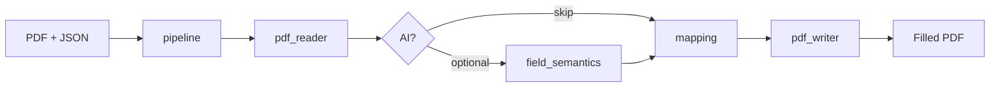

<div align="center">


# PDF Autofiller

**Fill any AcroForm PDF from JSON — no manual field mapping.**

Open-source FastAPI service · browser playground · Python SDK · Docker image

[](https://github.com/lindseystead/ai-pdf-autofiller/actions/workflows/test.yml)
[](https://github.com/lindseystead/ai-pdf-autofiller/releases)
[](https://github.com/lindseystead/ai-pdf-autofiller/stargazers)
[](https://www.python.org/downloads/)
[](https://github.com/lindseystead/ai-pdf-autofiller)
[](LICENSE)
[](https://github.com/lindseystead/ai-pdf-autofiller/pkgs/container/ai-pdf-autofiller)

[Try in Codespaces](#try-it-now) · [Install](#install) · [API](#api) · [FAQ](docs/FAQ.md) · [Roadmap](docs/ROADMAP.md) · [Recipes](recipes/) · [Docs](docs/)

[](https://codespaces.new/lindseystead/ai-pdf-autofiller)

**Keywords:** `pdf` · `acroform` · `form-filling` · `fastapi` · `python` · `automation` · `api` · `docker` · `document-processing` · `govtech` · `w9` · `self-hosted`

</div>

---

## What it does

Turn `{"firstname":"Jane","lastname":"Doe"}` into a filled PDF — even when the form uses `txtFirstName`, `given_name`, or other common synonyms. Opaque names like `field_12` use optional AI.

| Input | Output |
|-------|--------|
| Any fillable AcroForm PDF | Completed PDF with fields written |
| JSON user profile | Mapped automatically via aliases + normalization |
| Optional AI (off by default) | Semantic inference for opaque field names |

**Popular uses:** W-9 / tax forms · HR onboarding packets · government PDFs · insurance intake · workflow automation (n8n, Zapier, curl)

## Playground

Upload a PDF, paste JSON, download the result — no Postman required.


**Try free:** [Open in GitHub Codespaces](https://codespaces.new/lindseystead/ai-pdf-autofiller) → auto-opens `/playground`

## Try it now

```bash
# Docker Compose (includes sample PDF for the playground)
docker compose up --build
# → http://localhost:8000/playground → click "Use sample PDF"

# Or one-liner
docker run --rm -p 8000:8000 -e API_AUTH_ENABLED=false \
  ghcr.io/lindseystead/ai-pdf-autofiller:latest
```

Offline Python (no server):

```bash
pip install -e .
python3 -c 'from pdf_autofiller import fill; fill("samples/sample_form.pdf", {"firstname":"Jane","lastname":"Doe","dob":"1990-01-01"}, "filled.pdf")'
```

## Install

| Method | Command |
|--------|---------|
| **Docker Compose** | `docker compose up --build` |
| **Docker** | `docker run -p 8000:8000 -e API_AUTH_ENABLED=false ghcr.io/lindseystead/ai-pdf-autofiller:latest` |
| **From source** | `git clone https://github.com/lindseystead/ai-pdf-autofiller.git && cd ai-pdf-autofiller && pip install -r requirements-dev.txt && API_AUTH_ENABLED=false make run-api` |
| **GitHub Release wheel** | `make install-release` — supported install without PyPI ([Releases](https://github.com/lindseystead/ai-pdf-autofiller/releases)) |
| **Library (editable)** | `pip install -e .` then `from pdf_autofiller import fill` |
| **PyPI** | Deferred — `pip install pdf-autofiller` is not live yet. Workflow is ready (OIDC / `environment: pypi`) but manual until a one-time [Trusted Publisher](https://pypi.org/manage/account/publishing/) is added. See [docs/RELEASE.md](docs/RELEASE.md). |

```python
from pdf_autofiller import fill

# Local fill — no HTTP server required
fill("form.pdf", {"firstname": "Jane", "lastname": "Doe"}, "filled.pdf")
```

Remote HTTP client (when the API is running):

```python
from pdf_autofiller import PDFAutofillerClient

client = PDFAutofillerClient("http://localhost:8000", api_key="…")
client.fill_to_file("form.pdf", {"firstname": "Jane"}, "filled.pdf")
```

## API

| Method | Path | Description |
|--------|------|-------------|
| `GET` | `/` | Redirect to `/playground` |
| `GET` | `/playground` | Browser UI |
| `GET` | `/health` | Health + dependency checks |
| `GET` | `/version` | Service identity and version |
| `GET` | `/samples/sample_form.pdf` | Bundled demo form |
| `POST` | `/inspect` | List AcroForm fields as JSON |
| `POST` | `/preview` | Mapping decisions JSON (no PDF write) |
| `POST` | `/fill` | PDF in, filled PDF out |

Full contract: [docs/API.md](docs/API.md) · FAQ: [docs/FAQ.md](docs/FAQ.md) · Roadmap: [docs/ROADMAP.md](docs/ROADMAP.md)

## Why this exists

Manual PDF field mapping does not scale. AI-only fillers are hard to audit. **PDF Autofiller** is deterministic-first: most fields match via normalization and aliases with **no API key required**.

## Features

- FastAPI HTTP API with structured error codes
- Browser playground at `/playground`
- Python library: `fill`, `fill_detailed`, `inspect`, `preview` (+ HTTP `PDFAutofillerClient`)
- Deterministic alias packs (W-9-shaped / HR) + [recipes](recipes/) — synthetic corpus in CI
- Docker on GHCR · Render blueprint · GitHub Release wheels
- Auth, rate limits, and upload guards on by default

```python
from pdf_autofiller import fill, inspect, preview

print(inspect("form.pdf").field_count)
print(preview("form.pdf", {"firstname": "Jane"}).mapping.decisions)
fill("form.pdf", {"firstname": "Jane", "lastname": "Doe"}, "filled.pdf")
```

## Architecture



[docs/ARCHITECTURE.md](docs/ARCHITECTURE.md)

## Recipes

| Recipe | Form |
|--------|------|
| [w9.md](recipes/w9.md) | W-9-shaped synthetic + inspect inventory |
| [hr-onboarding.md](recipes/hr-onboarding.md) | HR intake / hire-date aliases |
| [sample-form.sh](recipes/sample-form.sh) | One-line demo |
| [integrations/n8n-fill-workflow.json](docs/integrations/n8n-fill-workflow.json) | Importable n8n workflow |

## Documentation

| Doc | Contents |
|-----|----------|
| [docs/FAQ.md](docs/FAQ.md) | vs SaaS, AcroForm vs scan, auth, local vs HTTP |
| [docs/ROADMAP.md](docs/ROADMAP.md) | Adoption phases and exit criteria |
| [docs/API.md](docs/API.md) | Endpoints and errors |
| [docs/RELEASE.md](docs/RELEASE.md) | Tag → PyPI / GHCR release runbook |
| [docs/OPERATIONS.md](docs/OPERATIONS.md) | Config and deployment |
| [docs/TESTING.md](docs/TESTING.md) | Tests and CI |
| [docs/integrations/](docs/integrations/) | n8n, Zapier, LangChain |
| [CONTRIBUTING.md](CONTRIBUTING.md) | How to contribute |
| [CHANGELOG.md](CHANGELOG.md) | Release history |

## Development

```bash
make test && make lint && make smoke-check
```

141 tests · 85%+ coverage · Python 3.11 & 3.12 · synthetic corpus 30/30

## License

MIT — [LICENSE](LICENSE)

---

<div align="center">

**Star the repo** if this saves you from mapping `txtFirstName` by hand.

</div>
