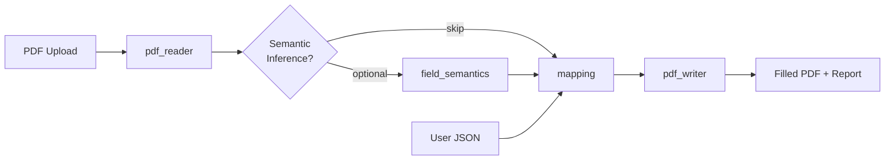

<div align="center">

# PDF Autofiller

**Fill any AcroForm PDF from JSON — no manual field mapping required.**

Deterministic-first pipeline with optional AI fallback. One API call turns messy government, HR, and insurance forms into completed PDFs.

[](https://github.com/lindseystead/ai-pdf-autofiller/actions/workflows/test.yml)
[](https://www.python.org/downloads/)
[](https://github.com/lindseystead/ai-pdf-autofiller)
[](LICENSE)
[](https://github.com/astral-sh/ruff)

[Quick Start](#quick-start) · [Playground](#playground) · [Python SDK](#python-sdk) · [Recipes](recipes/) · [Deploy](docs/DEPLOY.md) · [Docs](docs/)

</div>

---

## Try the Playground

**No install required after deploy.** Open the browser UI, upload a PDF, paste JSON, download the filled form.

```bash
make run-api
open http://localhost:8000/playground
```

[](https://render.com/deploy)

See [docs/DEPLOY.md](docs/DEPLOY.md) for one-click Render setup via `render.yaml`.

## Python SDK

```bash
pip install pdf-autofiller
```

```python
from pdf_autofiller import fill

fill("form.pdf", {"firstname": "Jane", "lastname": "Doe"}, "filled.pdf")
```

Remote API with auth:

```python
from pdf_autofiller.client import PDFAutofillerClient

client = PDFAutofillerClient("https://your-api.example.com", api_key="your-token")
client.fill_to_file("w9.pdf", {"name_line_1": "Jane Doe", "ssn": "..."}, "w9-filled.pdf")
```

## Recipes

Copy-paste recipes for common forms:

| Recipe | Description |
|--------|-------------|
| [recipes/w9.md](recipes/w9.md) | IRS Form W-9 from JSON |
| [recipes/hr-onboarding.md](recipes/hr-onboarding.md) | Employee intake packets |
| [recipes/sample-form.sh](recipes/sample-form.sh) | Bundled demo in one curl |

Community alias packs: [forms/README.md](forms/README.md)

## Demo

30-second terminal walkthrough: [docs/assets/DEMO.md](docs/assets/DEMO.md)

Generate a live transcript: `PYTHONPATH=src python -m scripts.generate_demo_output`

---

## The Problem

Every fillable PDF uses different field names. Your user profile says `first_name`, but the IRS form wants `txtFName`, the HR packet wants `givenName`, and the insurance PDF wants `field_12`.

Manual mapping does not scale. Heuristic-only tools are hard to audit. **PDF Autofiller** solves this with a pipeline you can trust:

1. **Normalize** keys and apply a growing alias vocabulary (25+ semantic concepts + community packs)
2. **Coerce** values to the right type (dates, numbers, booleans)
3. **Optionally infer** field meaning with AI — only when you enable it
4. **Reject** incomplete outputs when required fields are missing

## Who This Is For

| Audience | Use case |
|----------|----------|
| **SaaS builders** | Embed form-filling in onboarding, benefits enrollment, or gov-tech products |
| **Automation engineers** | Wire into Zapier, n8n, or internal workflows via a single HTTP endpoint |
| **Developers** | Ship a microservice that turns `{"firstname":"Jane"}` into a filled PDF in seconds |
| **Teams with compliance needs** | Deterministic mapping is auditable; AI is opt-in and PII-minimized |

## How It Works



| Module | Responsibility |
|--------|----------------|
| `pdf_reader.py` | Extract metadata, AcroForm fields, page text |
| `field_semantics.py` | Optional AI inference of field meaning |
| `mapping.py` | Deterministic matching, aliases, type coercion |
| `pdf_writer.py` | Write values, enforce required fields |
| `api_service.py` | HTTP API, auth, rate limits, validation |

## Quick Start

### Poetry (recommended)

```bash
git clone https://github.com/lindseystead/ai-pdf-autofiller.git
cd ai-pdf-autofiller
poetry install
make run-api
```

### pip

```bash
pip install -r requirements-dev.txt
make run-api
```

### Docker

```bash
docker build -t pdf-autofiller .
docker run -p 8000:8000 \
  -e API_AUTH_ENABLED=false \
  pdf-autofiller
```

Service runs at `http://localhost:8000`.

- **Playground UI:** `/playground`
- **API docs:** `/docs`
- **Health:** `/health`

### Playground

```bash
make run-api
# Open http://localhost:8000/playground
```

Drag a PDF, paste JSON, click **Fill PDF**, download the result.

### Try it in 30 seconds

```bash
# Fill the bundled sample form
PYTHONPATH=src python -m scripts.demo_workflow samples/sample_form.pdf

# Or hit the API directly
curl -s -X POST http://localhost:8000/fill \
  -H "X-API-Key: your-token" \
  -F "pdf_file=@samples/sample_form.pdf;type=application/pdf" \
  -F 'user_data={"firstname":"Jane","lastname":"Doe","dob":"1990-01-01"}' \
  -F "strict=true" \
  -o filled.pdf
```

Copy `.env.example` to `.env` and set `API_AUTH_TOKEN` before running in production.

## API Example

```bash
curl -s -X POST http://localhost:8000/fill \
  -H "X-API-Key: $API_AUTH_TOKEN" \
  -F "pdf_file=@samples/sample_form.pdf;type=application/pdf" \
  -F 'user_data={"firstname":"Jane","lastname":"Doe","dob":"1990-01-01","email":"jane@example.com"}' \
  -F "strict=true" \
  -o filled.pdf
```

**Endpoints:** `GET /` · `GET /playground` · `GET /health` · `GET /version` · `POST /fill`

Response headers include fill diagnostics: `X-PDF-Fields-Written`, `X-PDF-Fields-Skipped-Review`, and more. See [docs/API.md](docs/API.md).

## Configuration

| Variable | Default | Description |
|----------|---------|-------------|
| `API_AUTH_ENABLED` | `true` | Require `X-API-Key` on `POST /fill` |
| `API_AUTH_TOKEN` | — | Expected API key value |
| `API_KEY_HEADER` | `X-API-Key` | Header name for the token |
| `MODEL_PROVIDER_API_KEY` | — | Enables optional AI inference and fallback |
| `MAX_UPLOAD_BYTES` | `5242880` | Max PDF upload size (5 MB) |
| `MAX_PDF_PAGES` | `200` | Page-count DoS guard |
| `PDF_READ_TIMEOUT_SECONDS` | `20` | Parse/extraction time budget |
| `MAX_PDF_TEXT_CHARS` | `2000000` | Cap on extracted text volume |
| `RATE_LIMIT_PER_MINUTE` | `60` | Per-client fill budget (`0` = off) |
| `LOG_LEVEL` | `INFO` | Process log level |

Full reference: [.env.example](.env.example) · [docs/OPERATIONS.md](docs/OPERATIONS.md)

## Why Deterministic-First?

| Approach | Auditability | Setup | Cost |
|----------|--------------|-------|------|
| Manual field maps per PDF | High | Painful at scale | Engineer time |
| AI-only form filling | Low | Easy | Per-request LLM cost |
| **PDF Autofiller** | **High** | **Drop in a PDF + JSON** | **Free without AI** |

Most fields match via normalization and aliases — no API key required. Enable `use_semantic_inference` only when you need it.

## Quality & Security

- **CI:** ruff, mypy, pip-audit, pytest across Python 3.11 and 3.12
- **Coverage floor:** 85%
- **Auth on by default** — fails closed
- **DoS guards:** page limits, parse timeouts, upload size caps
- **PII-safe AI path:** fallback shares key *names* and value *types*, never raw values

## Scope

**In scope:** Fillable AcroForm PDFs, JSON user profiles, HTTP API, browser playground, Docker deployment, Python SDK.

**Out of scope (today):** Scanned PDFs / OCR, template persistence, signatures, bulk job queues.

## Documentation

| Doc | Contents |
|-----|----------|
| [docs/API.md](docs/API.md) | Endpoint contracts and examples |
| [docs/ARCHITECTURE.md](docs/ARCHITECTURE.md) | Module boundaries and data flow |
| [docs/OPERATIONS.md](docs/OPERATIONS.md) | Runtime config and deployment |
| [docs/PURPOSE.md](docs/PURPOSE.md) | Problem statement and use cases |
| [docs/COMPARISON.md](docs/COMPARISON.md) | vs DocuSign, Adobe, DIY pypdf |
| [docs/DEPLOY.md](docs/DEPLOY.md) | Render playground deployment |
| [docs/LAUNCH.md](docs/LAUNCH.md) | HN / Reddit / Product Hunt copy |
| [docs/integrations/](docs/integrations/) | n8n, Zapier, LangChain guides |
| [docs/TESTING.md](docs/TESTING.md) | Local validation workflow |
| [recipes/](recipes/) | W-9, HR onboarding curl recipes |
| [SECURITY.md](SECURITY.md) | Vulnerability reporting |
| [CHANGELOG.md](CHANGELOG.md) | Release history |

## License

MIT — see [LICENSE](LICENSE).

---

<div align="center">

**Built for developers who are tired of mapping `txtFirstName` by hand.**

If this saves you time, consider starring the repo — it helps others find it.

</div>
