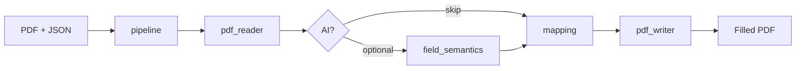

<div align="center">


# PDF Autofiller

**Fill any AcroForm PDF from JSON — no manual field mapping.**

Open-source FastAPI service · browser playground · Python SDK · Docker image

[](https://github.com/lindseystead/ai-pdf-autofiller/actions/workflows/test.yml)
[](https://github.com/lindseystead/ai-pdf-autofiller/releases)
[](https://github.com/lindseystead/ai-pdf-autofiller/stargazers)
[](https://www.python.org/downloads/)
[](https://github.com/lindseystead/ai-pdf-autofiller)
[](LICENSE)
[](https://github.com/lindseystead/ai-pdf-autofiller/pkgs/container/ai-pdf-autofiller)

[Try in Codespaces](#try-it-now) · [Install](#install) · [API](#api) · [Recipes](recipes/) · [Docs](docs/)

[](https://codespaces.new/lindseystead/ai-pdf-autofiller)

**Keywords:** `pdf` · `acroform` · `form-filling` · `fastapi` · `python` · `automation` · `api` · `docker` · `document-processing` · `govtech` · `w9` · `self-hosted`

</div>

---

## What it does

Turn `{"firstname":"Jane","lastname":"Doe"}` into a filled PDF — even when the form uses `txtFName`, `givenName`, or `field_12`.

| Input | Output |
|-------|--------|
| Any fillable AcroForm PDF | Completed PDF with fields written |
| JSON user profile | Mapped automatically via aliases + normalization |
| Optional AI (off by default) | Semantic inference for opaque field names |

**Popular uses:** W-9 / tax forms · HR onboarding packets · government PDFs · insurance intake · workflow automation (n8n, Zapier, curl)

## Playground

Upload a PDF, paste JSON, download the result — no Postman required.


**Try free:** [Open in GitHub Codespaces](https://codespaces.new/lindseystead/ai-pdf-autofiller) → auto-opens `/playground`

## Try it now

```bash
# Docker (fastest local)
docker run --rm -p 8000:8000 -e API_AUTH_ENABLED=false \
  ghcr.io/lindseystead/ai-pdf-autofiller:latest
# → http://localhost:8000/playground

# Or fill from curl
curl -s -X POST http://localhost:8000/fill \
  -F "pdf_file=@samples/sample_form.pdf;type=application/pdf" \
  -F 'user_data={"firstname":"Jane","lastname":"Doe","dob":"1990-01-01"}' \
  -F "strict=true" -o filled.pdf
```

## Install

| Method | Command |
|--------|---------|
| **Docker** | `docker run -p 8000:8000 -e API_AUTH_ENABLED=false ghcr.io/lindseystead/ai-pdf-autofiller:latest` |
| **GitHub Release** | `curl -fsSL .../scripts/install-from-release.sh \| bash` |
| **From source** | `git clone https://github.com/lindseystead/ai-pdf-autofiller.git && cd ai-pdf-autofiller && pip install -r requirements-dev.txt && make run-api` |

```python
from pdf_autofiller import fill
fill("form.pdf", {"firstname": "Jane", "lastname": "Doe"}, "filled.pdf")
```

## API

| Method | Path | Description |
|--------|------|-------------|
| `GET` | `/playground` | Browser UI |
| `GET` | `/health` | Health + dependency checks |
| `POST` | `/fill` | PDF in, filled PDF out |

Full contract: [docs/API.md](docs/API.md)

## Why this exists

Manual PDF field mapping does not scale. AI-only fillers are hard to audit. **PDF Autofiller** is deterministic-first: most fields match via normalization and aliases with **no API key required**.

## Features

- FastAPI HTTP API with structured error codes
- Browser playground at `/playground`
- Python SDK (`fill()` + `PDFAutofillerClient`)
- W-9 and HR alias packs + [recipes](recipes/)
- Docker on GHCR · Render blueprint · GitHub Release wheels
- Auth, rate limits, and upload guards on by default

## Architecture



[docs/ARCHITECTURE.md](docs/ARCHITECTURE.md)

## Recipes

| Recipe | Form |
|--------|------|
| [w9.md](recipes/w9.md) | IRS W-9 |
| [hr-onboarding.md](recipes/hr-onboarding.md) | Employee intake |
| [sample-form.sh](recipes/sample-form.sh) | One-line demo |

## Documentation

| Doc | Contents |
|-----|----------|
| [docs/API.md](docs/API.md) | Endpoints and errors |
| [docs/OPERATIONS.md](docs/OPERATIONS.md) | Config and deployment |
| [docs/TESTING.md](docs/TESTING.md) | Tests and CI |
| [docs/integrations/](docs/integrations/) | n8n, Zapier, LangChain |
| [CONTRIBUTING.md](CONTRIBUTING.md) | How to contribute |
| [CHANGELOG.md](CHANGELOG.md) | Release history |

## Development

```bash
make test && make lint && make smoke-check
```

105 tests · 85%+ coverage · Python 3.11 & 3.12

## License

MIT — [LICENSE](LICENSE)

---

<div align="center">

**Star the repo** if this saves you from mapping `txtFirstName` by hand.

</div>
