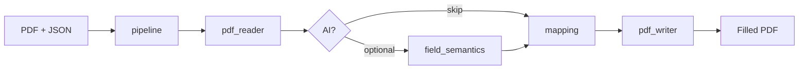

<div align="center">


# PDF Autofiller

**Fill AcroForm PDFs from JSON. Common field names match by alias. Optional AI is off by default.**

A free, self-hosted alternative to hosted PDF form-filling APIs like DocSpring or Anvil — no AI and no cloud calls by default.

Python library · CLI · FastAPI service · browser playground · Docker image

[](https://github.com/lindseystead/ai-pdf-autofiller/actions/workflows/test.yml)
[](https://pypi.org/project/pdf-autofiller/)
[](https://www.python.org/downloads/)
[](LICENSE)
[](https://github.com/lindseystead/ai-pdf-autofiller/pkgs/container/ai-pdf-autofiller)

[Quickstart](#quickstart) · [Playground](#playground) · [Install](#install) · [Comparison](#how-it-compares) · [API](#api) · [FAQ](docs/FAQ.md) · [Recipes](recipes/) · [Docs](docs/)

[](https://codespaces.new/lindseystead/ai-pdf-autofiller)
[](https://render.com/deploy?repo=https://github.com/lindseystead/ai-pdf-autofiller)

</div>

<!-- TODO: record docs/assets/demo.gif (playground: sample PDF → fill → download) and uncomment.
<p align="center"></p>
-->

---

## Quickstart

```bash
pip install pdf-autofiller
curl -LO https://raw.githubusercontent.com/lindseystead/ai-pdf-autofiller/main/samples/sample_form.pdf
```

```python
from pdf_autofiller import fill

report = fill("sample_form.pdf", {"firstname": "Jane", "lastname": "Doe", "dob": "1990-01-01"}, "filled.pdf")
print(report.written_fields)  # ['txtDOB', 'txtFirstName', 'txtLastName']
```

The form's fields are named `txtFirstName`, `txtLastName`, `txtDOB` — your keys match by alias.
Fills are **strict** by default: if a required field can't be resolved, nothing is written and an
error lists what's missing. Pass `allow_partial=True` to write anyway and read
`report.missing_required_fields`.

CLI:

```bash
pdf-autofiller fill sample_form.pdf --data '{"firstname":"Jane","lastname":"Doe","dob":"1990-01-01"}' -o filled.pdf
```

HTTP service + playground (open <http://localhost:8000/playground> and click **Use sample PDF**):

```bash
docker run --rm -p 8000:8000 -e API_AUTH_ENABLED=false ghcr.io/lindseystead/ai-pdf-autofiller:latest
```

From a clone, [`examples/quickstart.py`](examples/quickstart.py) runs the same fill against `samples/`.

**Live demo:** _coming soon_ <!-- TODO: add public demo URL (deployed from render-demo.yaml) -->

## What it does

Turn `{"firstname":"Jane","lastname":"Doe"}` into a filled PDF — even when the form uses `txtFirstName`, `given_name`, or other common synonyms. Opaque names like `field_12` can be addressed by exact name or mapped with optional AI; `/inspect` flags them.

| Input | Output |
|-------|--------|
| Fillable AcroForm PDF | Completed PDF with fields written |
| JSON user profile | Mapped via aliases + normalization |
| Optional AI (off by default) | Semantic inference for opaque field names |

**Popular uses:** HR onboarding packets · insurance intake · workflow automation (n8n, Zapier, curl) · W-9-shaped AcroForms (synthetic fixtures in CI — not IRS-certified)

## Playground

Upload a PDF (or click **Use sample PDF**), paste JSON, download the result — no Postman required.


Try it without installing: [Open in GitHub Codespaces](https://codespaces.new/lindseystead/ai-pdf-autofiller) (auto-opens `/playground`).
To host a public demo, use [`render-demo.yaml`](render-demo.yaml) (auth off, 10 req/min, 1 MiB uploads, no AI) — see [docs/OPERATIONS.md](docs/OPERATIONS.md#public-demo-deployment).
The **Deploy to Render** button above uses [`render.yaml`](render.yaml), a private deployment with an auto-generated API token.

## Install

| Method | Command |
|--------|---------|
| **pip** | `pip install pdf-autofiller` — library, `pdf-autofiller` CLI and API server |
| **Docker** | `docker run -p 8000:8000 -e API_AUTH_ENABLED=false ghcr.io/lindseystead/ai-pdf-autofiller:latest` (or `docker compose up --build` from a clone) |
| **From source** | `git clone https://github.com/lindseystead/ai-pdf-autofiller.git && cd ai-pdf-autofiller && pip install -e . && API_AUTH_ENABLED=false make run-api` |

Wheels are also attached to each [GitHub Release](https://github.com/lindseystead/ai-pdf-autofiller/releases).

Remote HTTP client (when the API is running with auth on):

```python
from pdf_autofiller import PDFAutofillerClient

client = PDFAutofillerClient("http://localhost:8000", api_key="…")
client.fill_to_file("sample_form.pdf", {"firstname": "Jane", "lastname": "Doe", "dob": "1990-01-01"}, "filled.pdf")
```

<details>
<summary>Demo transcript (curl inspect → preview → fill)</summary>

See the captured output in [`docs/assets/demo-terminal.txt`](docs/assets/demo-terminal.txt). Regenerate with `scripts/capture_demo_transcript.sh` while the API is running.

</details>

## How it compares

| | PDF Autofiller | [pypdf](https://github.com/py-pdf/pypdf) | [PyPDFForm](https://github.com/chinapandaman/PyPDFForm) | [Stirling-PDF](https://github.com/Stirling-Tools/Stirling-PDF) | DocSpring / Anvil |
|---|---|---|---|---|---|
| What it is | Form-fill library + HTTP API | General PDF library | Python form-filling library | Self-hosted PDF toolbox (web UI + API) | Hosted SaaS PDF APIs |
| Fill AcroForms | Yes | Yes (low-level) | Yes | Yes | Yes |
| Map JSON keys to differently-named fields | Aliases + normalization | No — exact names | No — exact names | No — exact names | Via templates built in their editor |
| Report of filled / unfilled / missing-required fields | Yes | No | No | No | Varies |
| HTTP API + playground | Yes | No | No | Yes | Yes (hosted) |
| Self-hosted, no outbound calls by default | Yes | Yes | Yes | Yes | No |
| Cost | Free (MIT) | Free (BSD) | Free (MIT) | Free core (open source) | Paid plans |

Use pypdf or PyPDFForm if you already know the exact field names and want a minimal dependency; use Stirling-PDF for a broad PDF toolbox; use a hosted service if you want template design tools and don't need self-hosting. PDF Autofiller is built on pypdf.

## API

| Method | Path | Description |
|--------|------|-------------|
| `GET` | `/` | Redirect to `/playground` |
| `GET` | `/playground` | Browser UI |
| `GET` | `/health` | Health + dependency checks |
| `GET` | `/version` | Service identity and version |
| `GET` | `/samples/sample_form.pdf` | Bundled demo form |
| `POST` | `/inspect` | List AcroForm fields as JSON |
| `POST` | `/preview` | Mapping decisions JSON (no PDF write) |
| `POST` | `/fill` | PDF in, filled PDF out |

Full contract: [docs/API.md](docs/API.md) · FAQ: [docs/FAQ.md](docs/FAQ.md) · Recipes: [recipes/](recipes/)

## Why this exists

Manual PDF field mapping does not scale. AI-only fillers are hard to audit. **PDF Autofiller** is deterministic-first: most fields match via normalization and aliases with **no API key required**.

## Features

- FastAPI HTTP API with structured error codes
- Browser playground at `/playground`
- Python library: `fill`, `fill_detailed`, `inspect`, `preview` (+ HTTP `PDFAutofillerClient`)
- CLI: `pdf-autofiller inspect|preview|fill` (also `python -m pdf_autofiller`)
- Deterministic alias packs (W-9-shaped / HR) + [recipes](recipes/) — synthetic corpus in CI
- Real-world form structures: radio groups by option name, hierarchical field names
  (`applicant.lastName`), nested JSON input, `/MaxLen` limits — dates written exactly as sent
- Partial fills (`allow_partial`) plus a report of every field left blank (`unfilled_fields`)
- PyPI · Docker on GHCR · Render blueprints (private + public demo) · GitHub Release wheels
- Auth, rate limits, and upload guards on by default

```python
from pdf_autofiller import fill, inspect, preview

print(inspect("samples/sample_form.pdf").field_count)
print(preview("samples/sample_form.pdf", {"firstname": "Jane"}).mapping.decisions)
fill("samples/sample_form.pdf", {"firstname": "Jane", "lastname": "Doe", "dob": "1990-01-01"}, "filled.pdf")
```

## Architecture


```mermaid
flowchart LR
    A[PDF + JSON] --> B[pipeline]
    B --> C[pdf_reader]
    C --> D{AI?}
    D -->|optional| E[field_semantics]
    D -->|skip| F[mapping]
    E --> F --> G[pdf_writer] --> H[Filled PDF]
```

[docs/ARCHITECTURE.md](docs/ARCHITECTURE.md)

## Recipes

| Recipe | Form |
|--------|------|
| [sample-form.sh](recipes/sample-form.sh) | Bundled demo |
| [w9.md](recipes/w9.md) | W-9-shaped synthetic (not IRS W-9) |
| [hr-onboarding.md](recipes/hr-onboarding.md) | Synthetic HR intake / hire-date aliases |
| [vendor-opaque.md](recipes/vendor-opaque.md) | Opaque inspect-derived widget names |
| [integrations/n8n-fill-workflow.json](docs/integrations/n8n-fill-workflow.json) | Importable n8n workflow |

## Documentation

| Doc | Contents |
|-----|----------|
| [docs/FAQ.md](docs/FAQ.md) | vs SaaS, AcroForm vs scan, auth, local vs HTTP |
| [docs/API.md](docs/API.md) | Endpoints and errors |
| [docs/OPERATIONS.md](docs/OPERATIONS.md) | Config and deployment |
| [SECURITY.md](SECURITY.md) | Reporting, auth, rate limits, data handling |
| [docs/TESTING.md](docs/TESTING.md) | Tests and CI |
| [docs/ARCHITECTURE.md](docs/ARCHITECTURE.md) | Module boundaries |
| [docs/RELEASE.md](docs/RELEASE.md) | Tag → PyPI / GHCR / Release assets |
| [docs/integrations/](docs/integrations/) | n8n, Zapier, LangChain |
| [samples/README.md](samples/README.md) | Corpus fixtures |
| [examples/](examples/) | Runnable scripts |
| [CONTRIBUTING.md](CONTRIBUTING.md) | How to contribute |
| [CHANGELOG.md](CHANGELOG.md) | Release history |

## Development

```bash
make test && make lint && make smoke-check && make corpus-check
```

CI runs the test suite on Python 3.11 & 3.12, enforces ≥85% coverage, and checks every expected field write in the [sample corpus](samples/README.md). See [docs/TESTING.md](docs/TESTING.md).

## License

MIT — [LICENSE](LICENSE)
