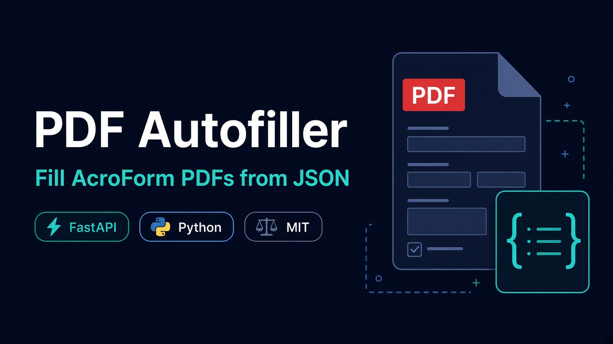
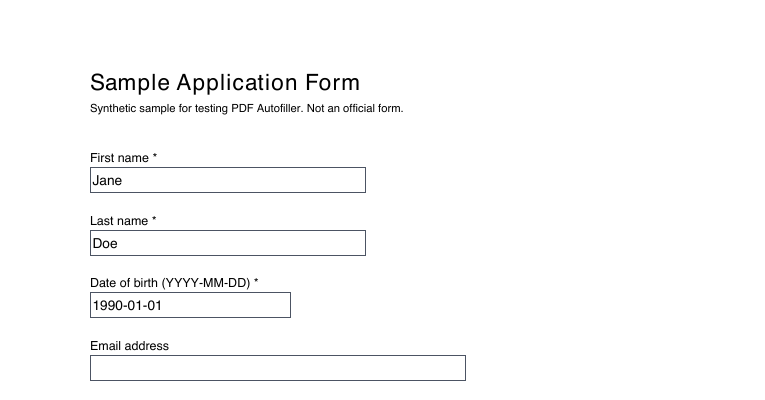
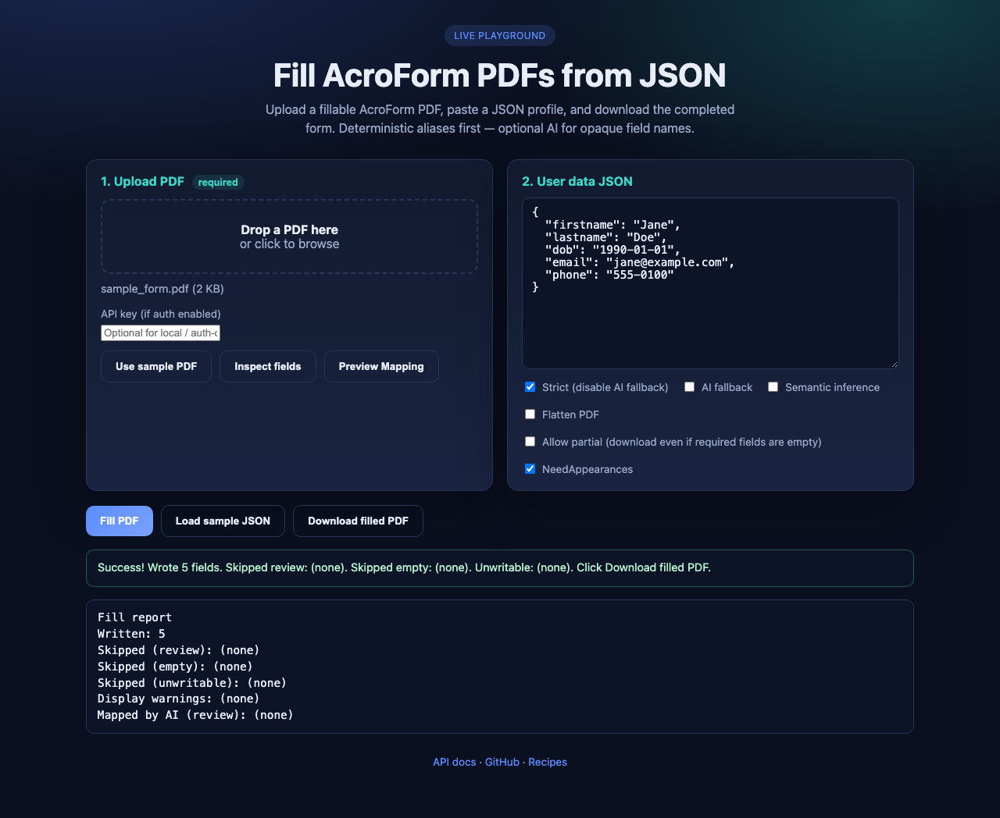

<div align="center">



# PDF Autofiller

**Fill PDF forms from JSON — as a Python library or a self-hosted API.**

Package and command name: `pdf-autofiller`.

Give it a fillable PDF form and your data as JSON; it fills the form and tells you exactly what
it filled and what it left blank. Runs locally with no AI and no network calls by default.

[](https://github.com/lindseystead/ai-pdf-autofiller/actions/workflows/test.yml)
[](https://www.python.org/downloads/)
[](LICENSE)

</div>

## The problem it solves

Many businesses fill the same PDF forms over and over: a W-9 for every contractor, an intake form
for every client, an onboarding packet for every hire. The information already exists in a
spreadsheet, a CRM or a web form, but someone retypes it into each PDF by hand.

PDF Autofiller does that step in code. Your data's key names don't have to match the form's
field names (`firstname` fills a field called `txtFirstName`), and every fill comes with a report,
so a missing required field stops the fill instead of slipping through.

## Who it's for

- **Developers** adding "fill this PDF" to an app or a script (Python library or CLI).
- **Automation builders** using n8n, Zapier or any HTTP tool: run the self-hosted API, send a
  PDF and JSON, get the filled PDF back.

It is **not** a good fit for scanned or flat PDFs (no form fields to fill), XFA forms made with
Adobe LiveCycle (common on some government sites), or collecting signatures.

## How it works

```
your data (JSON) ─┐
                  ├─► match keys to fields ─► fill ─► filled PDF
fillable PDF ─────┘                                 └► report: written / skipped / why
```

There is no app to log into. The server includes a small test page (`/playground`) for trying a
form in the browser; everything else is the library, the CLI and the HTTP API.

## What it handles

| Situation | What happens |
|-----------|--------------|
| Your keys differ from the field names | Matched by name (`First Name`, `first_name`, `txtFirstName`) and common synonyms (`dob` / `date_of_birth`) |
| A required field has no value | The fill stops and lists what's missing, unless you pass `allow_partial` |
| Checkboxes, radio buttons, dropdowns | `true` / `"yes"` tick a box; options match by value or label (`"CA"` or `"California"`) |
| Nested data (`{"applicant": {"name": …}}`) | Fills hierarchical fields like `applicant.name`; one value never fills another person's field |
| Text longer than the field allows | Skipped and reported, never cut off |
| Dates, ZIP codes, account numbers | Written exactly as sent (`"02134"` keeps its zero); invalid ones are flagged for review |
| Empty values | Skipped and reported, never written as `""` or `[]` |
| Names in other scripts (Chinese, Polish…) | Written, with a display warning; refused when flattening so garbled text isn't burned in |
| Encrypted PDFs | Filled when they open without a password; password-protected ones get a clear error |
| Signature fields | Never filled |
| Scanned PDFs or XFA forms | Nothing to fill; the result says so |
| Flattening (`flatten=True`) | Values become part of the page; values already in the form are kept |

## Quickstart

```bash
pip install git+https://github.com/lindseystead/ai-pdf-autofiller.git
curl -LO https://raw.githubusercontent.com/lindseystead/ai-pdf-autofiller/main/samples/sample_form.pdf
```

```python
from pdf_autofiller import fill

report = fill("sample_form.pdf", {"firstname": "Jane", "lastname": "Doe", "dob": "1990-01-01"}, "filled.pdf")
print(report.written_fields)  # ['txtDOB', 'txtFirstName', 'txtLastName']
```



Fills are **strict** by default: if a required field can't be resolved, nothing is written and the
error lists what's missing. Pass `allow_partial=True` to write anyway and check
`report.missing_required_fields`.

The same thing from the command line:

```bash
pdf-autofiller fill sample_form.pdf --data '{"firstname":"Jane","lastname":"Doe","dob":"1990-01-01"}' -o filled.pdf
```

## Self-hosted API

Run it as a service so other apps, scripts or workflow tools (n8n, Zapier) can send a PDF and JSON
and get the filled PDF back:

```bash
docker run --rm -p 127.0.0.1:8000:8000 -e API_AUTH_ENABLED=false ghcr.io/lindseystead/ai-pdf-autofiller:latest
# or without Docker, after pip install (listens on port 8000):
# API_AUTH_ENABLED=false pdf-autofiller-api
curl -F pdf_file=@sample_form.pdf -F 'user_data={"firstname":"Jane","lastname":"Doe","dob":"1990-01-01"}' \
  http://localhost:8000/fill -o filled.pdf
```

`API_AUTH_ENABLED=false` is for local use. In production, keep auth on and set `API_AUTH_TOKEN`;
clients send it as `X-API-Key`. See [docs/OPERATIONS.md](docs/OPERATIONS.md).

| Method | Path | Description |
|--------|------|-------------|
| `POST` | `/fill` | PDF + JSON in, filled PDF out |
| `POST` | `/preview` | Show how each field would be mapped, without writing |
| `POST` | `/inspect` | List the form's fields |
| `GET` | `/playground` | Test page for trying fills in the browser |
| `GET` | `/health`, `/version` | Health check and version |

All routes and error codes: [docs/API.md](docs/API.md). A Python client is included:
`PDFAutofillerClient("http://localhost:8000", api_key="YOUR_TOKEN").fill_to_file("form.pdf", data, "filled.pdf")`.

The server includes a small test page at `/playground` for trying fills without writing code:



## How matching works

1. Field names are normalized (case, spaces, underscores and prefixes like `txt`), so the key
   `first_name` or `firstname` fills a field named `First Name`, `first_name` or `txtFirstName`.
2. Built-in aliases cover common synonyms (`dob` / `date_of_birth`, `zip` / `postcode`), with
   optional packs for W-9-shaped and HR forms.
3. Anything left unmatched is reported, not guessed. Fields with opaque names (`field_12`) can be
   filled by their exact name. Two opt-in AI features can also help: **AI field inference**
   works out what each field means, and the **AI key fallback** picks which of your keys an
   unresolved field gets.
   Neither writes values of its own, but either can route one of your values to the wrong
   field, so every field they map is listed in the report as `ai_assisted_fields`. Details:
   [How AI is used](docs/ARCHITECTURE.md#how-ai-is-used).

## Alternatives

If you already know the exact field names, [pypdf](https://github.com/py-pdf/pypdf) (which this
project builds on) or [PyPDFForm](https://github.com/chinapandaman/PyPDFForm) are smaller
dependencies. Hosted services such as DocSpring or Anvil add visual template editors but run in
their cloud.

## More

- [Recipes](recipes/): W-9-shaped, HR onboarding and opaque-field examples, plus an importable
  [n8n workflow](docs/integrations/n8n-fill-workflow.json)
- [examples/quickstart.py](examples/quickstart.py): runnable example against `samples/`
- [FAQ](docs/FAQ.md) · [Architecture](docs/ARCHITECTURE.md) · [Security](SECURITY.md) ·
  [Changelog](CHANGELOG.md)

## Development

```bash
git clone https://github.com/lindseystead/ai-pdf-autofiller.git && cd ai-pdf-autofiller
python3 -m venv .venv && source .venv/bin/activate   # the Makefile uses the active Python
pip install -r requirements-dev.txt && pip install -e .
make test lint
```

CI runs the tests on Python 3.11 to 3.14 with an 85% coverage floor. See
[CONTRIBUTING.md](CONTRIBUTING.md) and [docs/TESTING.md](docs/TESTING.md).

## License

MIT — [LICENSE](LICENSE)
