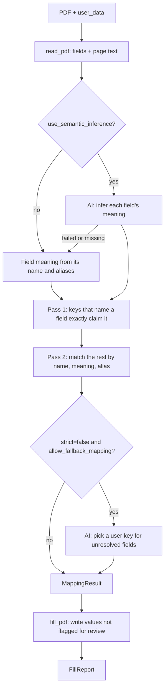

# Architecture

## Layers

The library core has no HTTP dependencies. The CLI and the HTTP API are thin layers over
`pipeline.py`, and nothing in the core imports `api/`.

```
cli.py ─┐
        ├─► pipeline.py ─► pdf_reader / mapping / pdf_writer ─► models.py
api/ ───┘    (api/jobs.py runs each pipeline call in a killable worker process)
```

| Module | Responsibility |
|--------|----------------|
| `pipeline.py` | Orchestrates read → enrich → map → write; exports `fill`, `fill_detailed`, `preview`, `inspect` |
| `pdf_reader.py` | Reads metadata, form fields and page text (`InvalidPdfError`, page limit, password detection) |
| `acroform_fields.py` | Walks the AcroForm tree; shared by reader and writer |
| `user_data.py` | Flattens nested JSON to dotted paths; type and depth checks |
| `field_utils.py` | Leaf names of hierarchical fields, required flag, opaque-name and no-fields hints |
| `aliases.py` | `AliasRegistry`: key normalization, built-in synonym clusters, JSON packs in `form_aliases/` |
| `mapping.py` | Matches user keys to fields; validates (never rewrites) dates and numbers; optional AI key fallback |
| `field_semantics.py` | The only module that calls the AI provider |
| `pdf_writer.py` | Writes values and enforces widget rules (button states, choice options, `/MaxLen`, fonts) |
| `models.py` | Pydantic contracts between stages: `MappingResult`, `FieldMappingDecision`, `FillReport` |
| `cli.py`, `__main__.py` | `pdf-autofiller inspect`, `preview` and `fill` (also `python -m pdf_autofiller`) |
| `client.py` | HTTP client for a remote server |
| `api/` | FastAPI app: routes, upload guard middleware, auth and rate limits, error catalog, job runner |
| `api_service.py` | ASGI / console-script entrypoint (`pdf_autofiller.api_service:app`) |
| `playground.py`, `static/` | The browser test page served at `/playground` |

## Fill flow



1. **Read.** `read_pdf` extracts fields and page text. Page text is only used by AI field inference.
2. **Enrich.** Each field gets a meaning (`first_name`, `date_of_birth`, …) and an expected
   type, from its name and the alias registry. With `use_semantic_inference`, the AI supplies
   them instead in one batched call; any failure is logged and falls back to the name-based
   meaning.
3. **Map.** `user_data` is flattened (`{"applicant": {"name": …}}` → `applicant.name`). Pass 1:
   a key that names a field exactly claims it, so it cannot also fill a sibling field. Pass 2:
   remaining fields match by field name, then meaning, then alias cluster. Dates and numbers
   are validated and written exactly as sent; anything that fails validation is flagged
   `requires_review`.
4. **Write.** `fill_pdf` writes every decision not flagged for review and enforces widget
   rules. In strict mode (the default) unresolved required fields stop the fill and nothing
   is written; `allow_partial` writes anyway and reports them.
5. **Report.** `FillReport` lists every field written, skipped (and why), left unfilled, drawn
   with a display warning, or mapped by the AI.

## How AI is used

Both AI features are off by default and need `MODEL_PROVIDER_API_KEY`. Each provider call times
out after 8 s without retrying, so both fit inside the API's 20 s job timeout.

| Step | Turned on by | Sent to the provider | Returned and checked |
|------|--------------|----------------------|----------------------|
| AI field inference (`field_semantics.py`) | `use_semantic_inference` / `--ai` | Field names, types, required flags, whether each field already has a value (never the value), and the first 500 characters of the text on the field's page | A meaning, type and confidence per field; unknown field names and invalid entries are dropped |
| AI key fallback (`mapping.py`) | `strict=false` + `allow_fallback_mapping` / `--no-strict` | For unresolved fields that are required or confidently typed: name, meaning, expected type and required flag; your **key names** and value **types** (never values) | For each field, one of your keys and a confidence in [0, 1]; anything else is dropped |

What the AI can and cannot do:

- **It cannot invent a value.** Every written value comes from `user_data`; the model only
  influences which field a value goes to.
- **It can put one of your real values in the wrong field.** Every mapping it influenced has
  `ai_assisted: true`, a reason starting with `AI:`, and a confidence no higher than the
  model's own. Mappings under 0.80 confidence are flagged for review and not written. Written
  ones are listed in `FillReport.ai_assisted_fields` (`X-PDF-Fields-AI-Assisted`).
- **Its input includes untrusted PDF text.** A hostile form can try to steer which key goes
  where; it cannot read your values. The model's reason text is capped and only shown as text.

## HTTP endpoints

| Method | Path | Notes |
|--------|------|-------|
| `GET` | `/` | Redirect to `/playground` |
| `GET` | `/playground` | Browser test page |
| `GET` | `/health` | Auth, alias packs and AI-provider readiness |
| `GET` | `/version` | Service name and version |
| `GET` | `/samples/sample_form.pdf` | Bundled sample form (unauthenticated) |
| `POST` | `/inspect` | Field inventory |
| `POST` | `/preview` | Mapping decisions without writing a PDF |
| `POST` | `/fill` | Filled PDF, or a JSON report with `pdf_base64` when `Accept: application/json` |

Upload routes check auth, rate limits and body size before the body is read
(`api/middleware.py`), and every pipeline call runs in a separate process that is killed at
the timeout (`api/jobs.py`).

## Extension points

- Alias packs: `src/pdf_autofiller/form_aliases/*.json`, each proven by a case in
  `tests/fixtures/corpus/cases.json`.
- New value types: extend `coerce_value` in `mapping.py` (validate, do not rewrite).

## Not in scope

- Scanned or flat PDFs (no form fields), and XFA-only forms.
- Official IRS or vendor form certification: the sample PDFs are synthetic.
